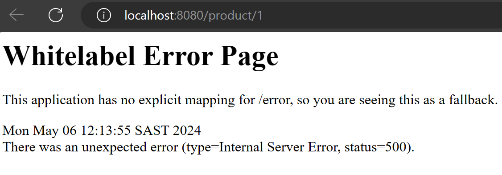
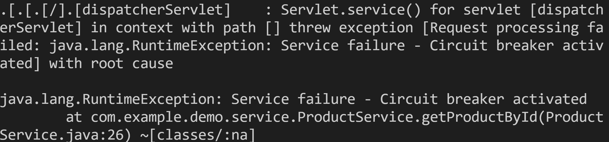

# Basic Reliable Web App Demo

In this quick demo, we will explore reliable web app patterns. These are design strategies used in web development to ensure the robustness, scalability, and efficiency of web applications. We will use a simple project to demonstrate core reliable web app patterns such as caching, resiliency, and fault tolerance.

- For caching, the project employs the cache-aside pattern and utilizes the Caffeine library to manage the cache effectively.
- To improve system reliability, resiliency patterns such as circuit breakers and retries are implemented, enhancing the application's fault tolerance.

## Prerequisites

- Java 17
- Maven 3.6+

## Installation

1. Navigate to the project directory:

```bash
cd Part0-Basic-App/demo
```

2. Install dependencies:

```bash
mvn clean install
```

## Usage

Start the application using Maven:

```bash
mvn spring-boot:run
```

You can then access the API at `http://localhost:8080/product/1`.

### Example API Call

To retrieve a product by its ID, you can use the following curl command:

```bash
curl http://localhost:8080/product/1
```

## Running the Tests

To run the automated tests for this system, use the following command:

```bash
mvn test
```

These tests verify the functionality of all components, ensuring that the application behaves as expected.

## Failure Mode

One of the most essential principles of the Reliable Web App pattern is the Retry Pattern. It helps your application deal with situations where a service might be temporarily down, a ‘transient fault’. The Retry pattern resends failed requests to the service until it’s working again.

But the Retry Pattern alone is not enough. Sometimes, a service might be unavailable for a long time, or it might even be gone forever. It would be useless to keep trying to call such a service. That’s why we need the Circuit Breaker Pattern.

The application includes a feature to simulate failures, useful for testing its resilience capabilities such as the circuit breaker and retry mechanisms. This simulation can be controlled directly from a web browser, making it easy to demonstrate or test the effects of these patterns.

### Enabling Failures

To simulate failures in the system, which will trigger the circuit breaker or retry logic, you can activate failure mode using the following URL:

```plaintext
http://localhost:8080/configure/failure?fail=true
```
You can then trigger the failure at `http://localhost:8080/product/1`.

View the logs in your browser and terminal:




### Disabling Failures

To return the system to normal operation, disable the failure mode using this URL:

```plaintext
http://localhost:8080/configure/failure?fail=false
```
Test the application again by accessing `http://localhost:8080/product/1`.

> ## Notes
> Remember to close your terminal by pressing `Ctrl+C` to stop the application.

## Circuit Breaker in Testing

The circuit breaker pattern is crucial for managing failures in distributed systems. It prevents a network or service failure from causing your application to become unstable. This pattern temporarily halts operations when a particular service or operation fails repeatedly, which is vital for maintaining overall system health.

The `ProductServiceTest` class in the `Part0-Basic-App/demo/src/test/java/com/example/demo/service/ProductServiceTest.java` tests this behavior by simulating failures to trigger the circuit breaker. Here's an explanation of the test and the method it tests:

### Code Snippets and Explanation

**getProductById Method in ProductService**

This method includes a circuit breaker and retry mechanism, which are critical for handling failures in production environments. Here’s how it works:

```java
    @CircuitBreaker(name = "default", fallbackMethod = "fallback")
    @Retry(name = "default")
    public Product getProductById(Long id) {
        if (failForCircuitBreakerTest || Math.random() > 0.7) {
            throw new RuntimeException("Service failure - Circuit breaker activated");
        }
        return new Product(id, "Product Name", "Product Description");
    }
```
The line if (failForCircuitBreakerTest || Math.random() > 0.7) in the getProductById method plays a critical role in testing and demonstrating the resilience of the application under unpredictable conditions. Here's a detailed explanation:

This condition integrates a manual flag (failForCircuitBreakerTest) and a probabilistic factor (Math.random() > 0.7) to simulate failures within the system. The manual flag allows developers to forcibly trigger the failure mode, which is useful during controlled tests to ensure that the circuit breaker properly handles expected failure scenarios. On the other hand, the random component introduces a degree of unpredictability into the system's behavior, which mimics real-world scenarios where services may fail sporadically due to various unpredictable factors such as network issues, server overload, or external service failures.

Using a random factor with a threshold of 0.7 means that there is approximately a 30% chance of triggering a failure whenever this method is called. This setup helps in validating the robustness of the system's fault tolerance mechanisms. It ensures that the application can gracefully handle interruptions and continue functioning without major disruptions, thereby maintaining a reliable service level for users even under adverse conditions.

Incorporating such randomness and manual flags into the system's logic is necessary for thorough testing of the resilience patterns implemented in the application. It provides a way to ensure that the circuit breaker and other defensive programming techniques are correctly configured and capable of handling real-world operational stresses effectively.

**ProductServiceTest Class**

The test method simulates a scenario where the `getProductById` method is called and a failure is expected to trigger the circuit breaker:

```java
    @Test
    public void whenGetProductByIdCalledMultipleTimes_thenCircuitBreakerShouldBeTriggered() {
        boolean exceptionThrown = false;
        for (int i = 0; i < 20; i++) {
            try {
                productService.getProductById((long) i);
            } catch (RuntimeException e) {
                exceptionThrown = true;
            }
        }
        assertTrue(exceptionThrown);
    }
```

This test ensures that the circuit breaker is functioning as expected by verifying that an exception is thrown when the method is repeatedly called under failure conditions.

These explanations and code snippets help illustrate how the circuit breaker pattern is implemented and tested within this part of the workshop.

## Conclusion

This project provides a simple demonstration of reliable web app patterns in action. By exploring the code and running the application, you can gain a better understanding of how these patterns can enhance the reliability and performance of web applications.

## Next Up

Next, we will deploy the RWA reference application on Azure --> [Part 1 - Tooling](../Part1-Tooling/README.md) 
