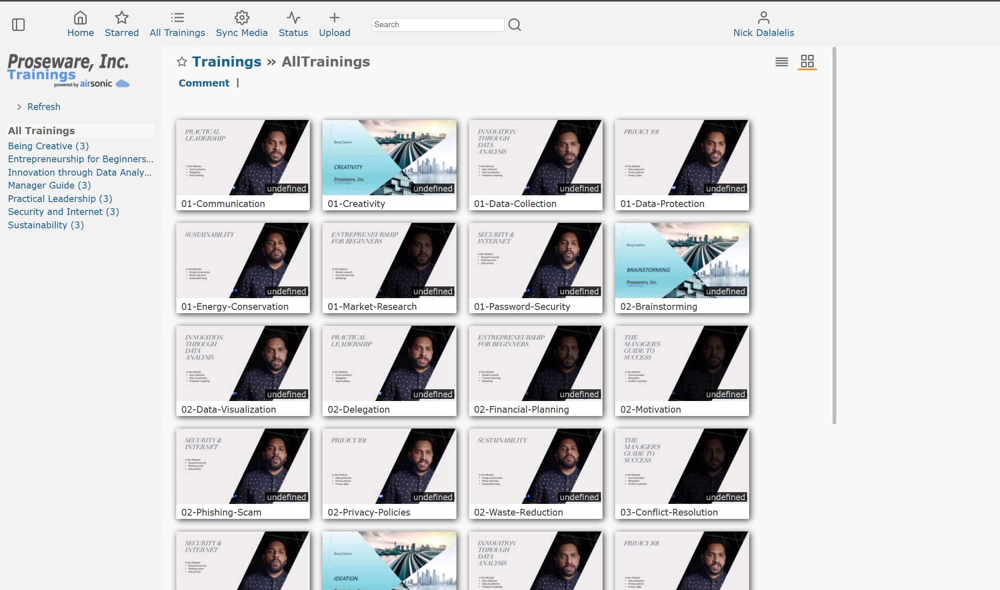

## Prerequisites

- [Azure Subscription](https://azure.microsoft.com/pricing/member-offers/credit-for-visual-studio-subscribers).
- [Visual Studio Code](https://code.visualstudio.com/).
- [Docker Desktop](https://www.docker.com/get-started/).
- [Permissions to register an application in Azure AD](https://learn.microsoft.com/entra/identity-platform/quickstart-register-app).
- Visual Studio Code [Dev Containers extension](https://marketplace.visualstudio.com/items?itemName=ms-vscode-remote.remote-containers).

> **WINDOWS**
> If you are using Windows, you must enable long paths.  Perform the following steps as a local Administrator:
>
> - Open the Registry Editor, navigate to `HKLM\SYSTEM\CurrentControlSet\Control\FileSystem` and set DWORD `LongPathsEnabled` to 1.
> - Run `git config --system core.longpaths true`

## Detailed deployment steps 

### 1. Clone the Reference App repo

If using Windows, ensure you have enabled long paths.  Then clone the repository from GitHub:

```shell
git clone https://github.com/Azure/reliable-web-app-pattern-java-workshop.git
cd reliable-web-app-pattern-java
```

### 2. Open Dev Container in Visual Studio Code

If required, ensure Docker Desktop is started and enabled for your WSL terminal [more details](https://learn.microsoft.com/windows/wsl/tutorials/wsl-containers#install-docker-desktop). Open the repository folder in Visual Studio Code. You can do this from the command prompt:

```shell
code .
```

Once Visual Studio Code is launched, you should see a popup allowing you to click on the button **Reopen in Container**.


If you don't see the popup, open the Visual Studio Code Command Palette to execute the command. There are three ways to open the command palette:

- For Mac users, use the keyboard shortcut ⇧⌘P
- For Windows and Linux users, use Ctrl+Shift+P
- From the Visual Studio Code top menu, navigate to View -> Command Palette.

Once the command palette is open, search for `Dev Containers: Rebuild and Reopen in Container`.


### 3. Log in to Azure

Before deploying, you must be authenticated to Azure and have the appropriate subscription selected. Each command will open a browser, allowing you to authenticate:

```shell
az login --scope https://graph.microsoft.com//.default
azd auth login
```
To list the subscriptions you have access to:

```shell
az account list
```

To set the active subscription:

```shell
export AZURE_SUBSCRIPTION="<your-subscription-id>"
az account set --subscription $AZURE_SUBSCRIPTION
azd config set defaults.subscription $AZURE_SUBSCRIPTION
```

### 4. Create a new environment

The environment name should be less than 18 characters and must be comprised of lower-case, numeric, and dash characters (for example, `eap-javarwa`).  The environment name is used for resource group naming and specific resource naming. Also, select a password for the admin user of the database.

Run the following commands to set these values and create a new environment:

```shell
azd config set alpha.terraform on
azd env new eap-javarwa
azd env set DATABASE_PASSWORD "AV@lidPa33word"
```

Replace the placeholders for the environment name and database password with your own values.

In this workshop, as we are only using one region, Azure resources will be sized for a "development" mode. Set the `APP_ENVIRONMENT` to `dev` using the following code to deploy development SKUs:

```shell
azd env set APP_ENVIRONMENT dev
```

We will explore more information on production development in part 3 - Cost Optimization

### 5. Select a region for deployment

Our application will be deployed as a single region. You can find a list of available Azure regions by running the following Azure CLI command.

> ```shell
> az account list-locations --query "[].name" -o tsv
> ```

Set the `AZURE_LOCATION` 

```shell
azd env set AZURE_LOCATION eastus
```

### 6. Provision and deploy the application

Run the following command to create the infrastructure:

```shell
azd provision --no-prompt
```

Run the following command to deploy the code to the created infrastructure:

```shell
azd deploy
```

The duration of the provisioning and deployment process can vary from 20 minutes to over an hour, depending on the system load and your internet bandwidth.

### 7. Open and use the application

Use the following to find the URL for the Proseware application that you have deployed:

```shell
azd env get-values --output json | jq -r .frontdoor_url
```



Please note that it may take approximately 5 minutes for the Azure App Service to start responding to requests after the code has been deployed in step 6.

### 9. Next Up

Now that you have deployed the reference implementation, you can move on to the next section of the workshop - an overview of the Reliable Web Application pattern. 

[Part 2 - RWA Overview](../Part2-RWA-Overview/README.md)

### Appendix A - Quick Steps to deploy the reference implementation

This section describes the nine steps to deploy the reference implementation of a reliable web application pattern with Java on Microsoft Azure, including the teardown process.

For users familiar with the deployment process, you can use the following list of the deployments commands as a quick reference. The commands assume you have logged into Azure through the Azure CLI and Azure Developer CLI and have selected a suitable subscription:

```shell
git clone https://github.com/Azure/reliable-web-app-pattern-java.git
cd reliable-web-app-pattern-java
azd config set alpha.terraform on
azd env new eap-javarwa
azd env set DATABASE_PASSWORD "AV@lidPa33word"
azd env set AZURE_LOCATION eastus
azd up
azd deploy
```

### Appendix B (only to be run after completing the workshop)

To tear down the deployment, run the following command:

```shell
azd down
```
