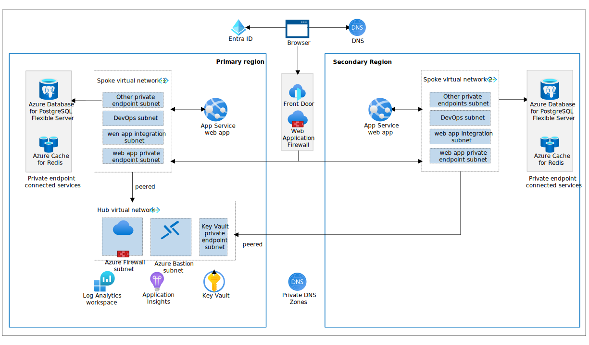

# Introduction

## Notes
In this section, we'll setup the reference example to be explored in part 2-7. The provisioning and deployment will take 40 minutes. Between the provision and deployment, please proceed to parts 2-7 so you can continue with the workshop while the installation is running.

The reference implementation is a production-grade web application that demonstrates the reliable web app pattern using Java technologies. It guides developers through migrating an on-premises web application to Azure, showcasing architectural changes and enhancements that leverage Azure strengths.

## Architecture

Contoso Fiber aligned to a hub and spoke network topology in the production deployment architecture to centralize common resources. This network topology provided cost savings, enhanced security, and facilitated network integration (platform and hybrid):



This diagram describes the production deployment. In the workshop we will only be deploying a [development deployment](./images/reliable-web-app-java-dev.svg) which is a simplified version.

## Detailed deployment steps 

### 1. Clone the repo

> For Windows users, we recommend using Windows Subsystem for Linux (WSL) to [improve Dev Container performance](https://code.visualstudio.com/remote/advancedcontainers/improve-performance).

```pwsh
wsl
```

Clone the repository and open the project using the Dev Container.

```shell
git clone https://github.com/Azure/reliable-web-app-pattern-java.git

cd reliable-web-app-pattern-java
```

### 2. Open Dev Container in Visual Studio Code

If required, ensure Docker Desktop is started. Open the repository folder in Visual Studio Code. You can do this from the command prompt:

```shell
code .
```

Once Visual Studio Code is launched, you should see a popup allowing you to click on the button **Reopen in Container**.


If you don't see the popup, open the Visual Studio Code Command Palette to execute the command. There are three ways to open the command palette:

- For Mac users, use the keyboard shortcut ⇧⌘P
- For Windows and Linux users, use Ctrl+Shift+P
- From the Visual Studio Code top menu, navigate to View -> Command Palette.

Once the command palette is open, search for `Dev Containers: Rebuild and Reopen in Container`.


### 3. Log in to Azure

Before deploying, you must be authenticated to Azure and have the appropriate subscription selected. Run the following command to authenticate:

```shell
az login --scope https://graph.microsoft.com//.default
```

Set the subscription to the one you want to use (you can use [az account list](https://learn.microsoft.com/en-us/cli/azure/account?view=azure-cli-latest#az-account-list) to list available subscriptions):

```shell
export AZURE_SUBSCRIPTION_ID="<your-subscription-id>"
```

```pwsh
az account set --subscription $AZURE_SUBSCRIPTION_ID
```

Use the next command to login with the Azure Dev CLI (AZD) tool:

```pwsh
azd auth login
```

### 4. Create a new environment

Next we provide the AZD tool with variables that it uses to create the deployment. The first thing we initialize is the AZD environment with a name.

The environment name should be less than 18 characters and must be comprised of lower-case, numeric, and dash characters (for example, `contosowebapp`).  The environment name is used for resource group naming and specific resource naming.

By default, Azure resources are sized for a development deployment. If doing a production deployment, see the [production deployment](./prod-deployment.md) instructions for more detail.

```shell
azd env new <pick_a_name>
```

Enable the AZD Terraform provider:

```shell
azd config set alpha.terraform on
```

Select the subscription that will be used for the deployment:
```shell
azd env set AZURE_SUBSCRIPTION_ID $AZURE_SUBSCRIPTION_ID
```

Set the Azure region to be used:

```shell
azd env set AZURE_LOCATION <pick_a_region>
```

### 5. Create the Azure resources and deploy the code

Run the following command to create the Azure resources and deploy the code (about 15-minutes to complete):

```shell
azd up
```

### 6. Open and use the application

Navigate to the Front Door URL in a browser to view the Contoso Fiber CAMS application. Use the Endpoint URL from the output of the deployment.

You will see an output similar to the following:

```shell
Deploying services (azd deploy)

  (✓) Done: Deploying service application
  - Endpoint: https://fd-contosocams-dev-frcfgefndcctbgdh.z02.azurefd.net
```

### 7. Next Up

Now that you have deployed the reference implementation, you can move on to the next section of the workshop - an overview of the Reliable Web Application pattern. 

[Part 2 - RWA Overview](../Part2-RWA-Overview/README.md)

### Appendix A (only to be run after completing the workshop)

To tear down the deployment, run the following command:

```shell
azd down --purge --force
```
