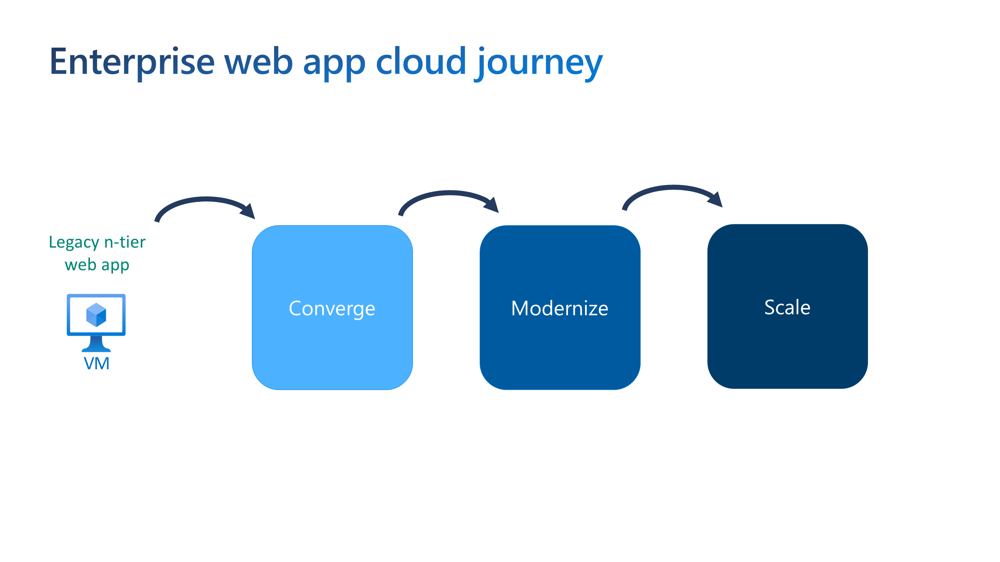
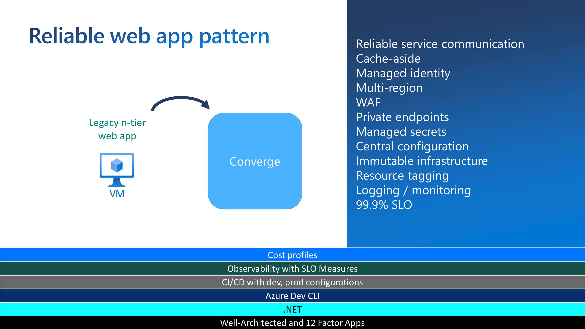
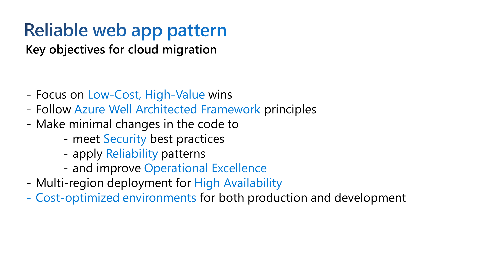

# Reliable Web App Pattern - Java Overview

The reliable web app pattern is a set of principles that helps developers successfully migrate web applications to the cloud. It provides implementation guidance built on the Azure Well-Architected Framework. The pattern focuses on the minimal changes you need to make to ensure the success of your web app in the cloud.

In this workshop we're going to run through the principles and show how to apply them to your web applications.

## Enterprise web app cloud journey

Imagine a web application's evolution in the cloud as a journey. Each step in the journey has different goals. The reliable web app pattern is designed to help you take the first step in the journey. You may only need to "lift and shift" or converge your application to the cloud, and do so with a minimal amount of changes. The reliable web app pattern helps you do that.

Further along in the journey, you may want to refactor your application to take advantage of cloud-native features and then optimize it for scale and performance.

But first, let's explore what it means to converge in the cloud and create an application that's reliable with minimal changes in your existing investment.

## Pattern of patterns

That's not to say that the reliable web app pattern is simplistic. It's not. It's a pattern of patterns. Each pattern provides prescriptive guidance on how to build a specific aspect of a reliable web application. You can use them together or separately.

The image below shows just some of the considerations that you'll need to take into account when converging to the cloud and the reliable web app pattern provides guidance on those. In fact, the reliable web app pattern builds on real-world tested technologies and techniques, like the Azure Well-Architected Framework to produce the set of patterns that you'll learn about in the image below.

## Objectives

The objectives of the reliable web app pattern are straightforward. It's designed to help you:

## The Five Pillars

The reliable web app pattern is built off of 5 pillars. Each pillar is a set of patterns that are derived from both the Azure Well-Architected Framework and 12-factor app methodology.

## Reference application

- The reference application has the option to use either one or two regions in an active-passive configuration to meet the service level objective of 99.9%. The two region option uses Azure Front Door as the global load balancer. Front Door routes all traffic to the active region. The passive region is for failover only. The failover plan is manual and there are no automated scripts with this repo.
- All inbound HTTPS traffic passes through Front Door and Web Application Firewall (WAF). WAF inspects the traffic against WAF policies.
- The web app code implements the Retry, Circuit Breaker, and Cache-Aside patterns. The web app integrates with Azure AD using the Spring Boot Starter for Azure Active Directory.
- Application Insights is the application performance management tool, and it gathers telemetry data on the web app.
- App Service uses virtual network integration to communicate securely with other Azure resources within the private virtual network. App Service requires an `App Service delegated subnet` in the virtual network to enable virtual network integration.
- Key Vault and Azure Cache for Redis have private endpoints in the `Private endpoints subnet`. Private DNS zones linked to the virtual network resolve DNS queries for these Azure resources to their private endpoint IP address.
- Azure Database for PostgreSQL - Flexible server uses virtual network integration for private communication. It doesn't support private endpoints.
- The web app uses an account access key to mount a directory with Azure Files to the App Service. A private endpoint is not used for Azure Files to facilitate the deployment of the reference implementation for everyone. However, it is recommended to use a private endpoint in production as it adds an extra layer of security. Azure Files only accepts traffic from the virtual network and the local client IP address of the user executing the deployment.
- App Service, Azure Files, Key Vault, Azure Cache for Redis, and Azure Database for PostgreSQL use diagnostic settings to send logs and metrics to Azure Log Analytics Workspace. Log Analytics Workspace is used to monitor the health of Azure services.
- Azure Database for PostgreSQL uses a high-availability zone redundant configuration and a read replica in the passive region for failover.

## Next Up

Now that you have a basic understanding of what the reliable web app pattern is, let's look at the next 5 sections which give us the reference example to showcase the pillars - we can start on how to optimize costs.

[Part 3 - Cost Optimization](../Part3-Cost-Optimization/README.md)

