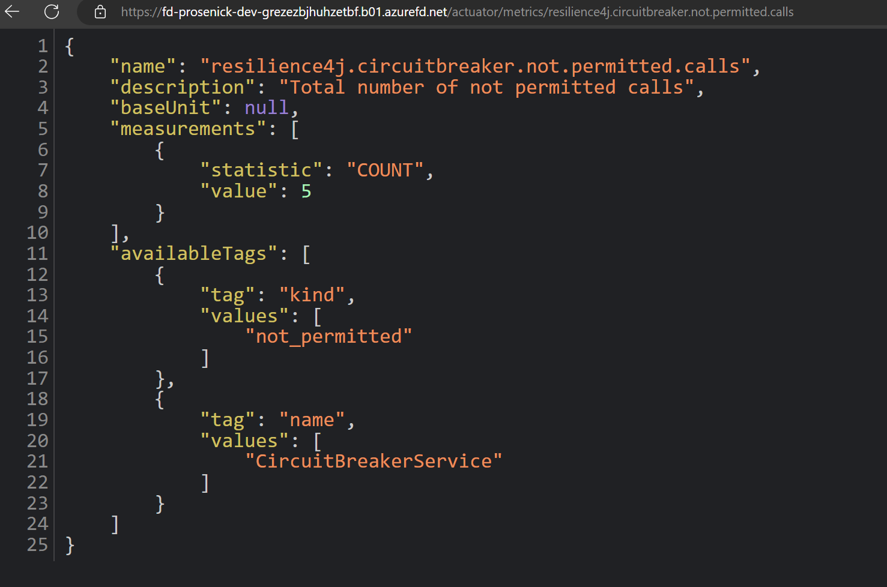

# Reliability

In this part, we'll guide you through the process of testing and configuring three key code-level design patterns: retry, circuit-breaker, and cache-aside, using our implementation. The upcoming sections will provide detailed steps for you to follow and experiment with these design patterns.

## Retry and Circuit Break Pattern

We built an app configuration setting that lets you simulate and test a transient failure when making a web request to GitHub. The reference implementation uses the `Spring Boot Actuator` to monitor retries. After deploying the application, navigate to your site’s `/actuator` endpoint to see a list of Spring Boot Actuator endpoints. Navigate to `/actuator/retries` to see retried calls. Set the `AIRSONIC_RETRY_DEMO` application setting to 1. This will simulate a failure for every web request to GitHub. A value of 2 generates a 503 error for every other request.

Follow these steps to set up this test:

1. Set the `AIRSONIC_RETRY_DEMO` setting to 1 in App Service Configuration.

1. Changing a application setting will cause the App Service to restart. Wait for the app to restart.

1. We added Spring Actuator Dependencies to the Proseware project. This enables actuator endpoints. Navigate to the following sites.
    * https://<APP_NAME>.azurewebsites.net/actuator
    * https://<APP_NAME>.azurewebsites.net/actuator/retryevents
    * https://<APP_NAME>.azurewebsites.net/actuator/retryevents
    * https://<APP_NAME>.azurewebsites.net/actuator/metrics/resilience4j.circuitbreaker.not.permitted.calls

1. Navigate to https://<APP_NAME>.azurewebsites.net/index and refresh the page. Every time you refresh the page, a call to GitHub is made.

1. Make note of the retry events and circuit breaker in the actuator endpoints.

## Logs

Application logging is enabled. To view the logs, navigate to *Diagnose and solve problems*. From there, click on *Application Logs*.

## Application Insights

Exceptions in the Prosware web application are reported with Application Insights. Some videos in Proseware cannot be played correctly. 

Using *Application Insights*, we see that a NullPointerException was thrown while processing the videos.

In conclusion, monitoring and diagnosing exceptions in your application is crucial for maintaining a healthy and reliable system. Application Insights provides valuable insights into the exceptions that occur in your application, helping you identify and fix issues promptly.

Next, we will delve into the security aspects of cloud applications. Please proceed to [Part 5 - Security](../Part5-Security/README.md) for more information.
