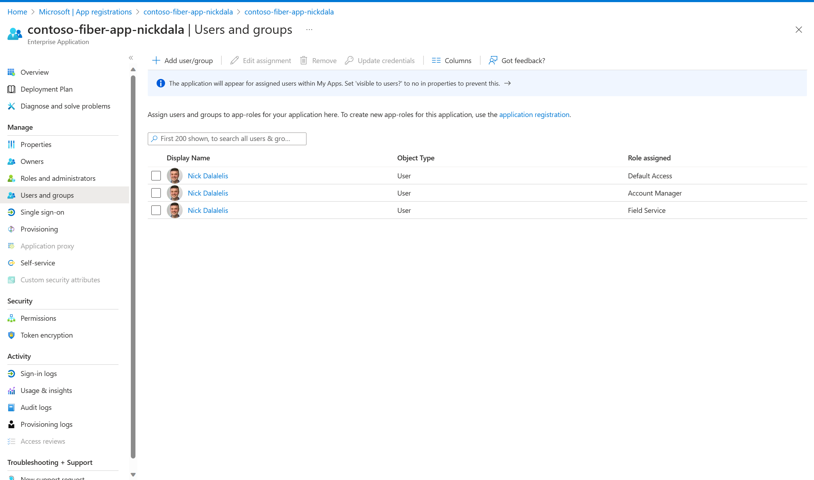

# Security

The Reliable Web App pattern uses managed identities to implement identity-centric security. Private endpoints, web application firewall, and restricted access to the web app provide a secure ingress.

## RBAC

The web app also includes a role-based access control (RBAC) feature. The Contoso Fiber team uses Microsoft Entra ID for authentication. Contoso Fiber chose Microsoft Entra ID for the following reasons:

- Authentication and authorization. It handles authentication and authorization of employees.
- Scalability. It scales to support larger scenarios.
- User-identity control. Employees can use their existing enterprise identities.
- Support for authorization protocols. It supports OAuth 2.0 for managed identities.

This system has an "Account Manager" role and a "Field Service" role. The "Account Manager" role has access to create new Accounts.

## WAF

Azure Web Application Firewall (WAF) is Azure's web application firewall and provides centralized protection of from common web exploits and vulnerabilities.

Contoso Fiber chose the Web Application Firewall for the following benefits:

- Global protection. It provides increased global web app protection without sacrificing performance.
- Botnet protection. You can configure bot protection rules to monitor for botnet attacks.
- Parity with on-premises. The on-premises solution was running behind a web application firewall managed by IT.

## Secrets manager

Contoso Fiber has secrets to manage. They used Key Vault for the following reasons:

- Encryption. It supports encryption at rest and in transit.
- Supports managed identities. The application services can use managed identities to access the secret store.
- Monitoring and logging. It facilitates audit access and generates alerts when stored secrets change.
- Integration. It supports two methods for the web app to access secrets. Contoso Fiber can use app settings in the hosting platform (App Service), or they can reference the secret in their application code (app properties file).

## Azure Private link

Azure Private Link provides access to platform-as-a-service solutions over a private endpoint in your virtual network. Traffic between your virtual network and the service travels across the Microsoft backbone network.

Contoso Fiber chose Private Link for the following reasons:

- Enhanced security. It lets the application privately access services on Azure and reduces the network footprint of data stores to help protect against data leakage.
- Minimal effort. Private endpoints support the web app platform and the database platform that the web app uses. Both platforms mirror the existing on-premises setup, so minimal changes are required.

## Exercise - View your *User* 

By default, your user account is added to the application with the "User" role.
In this exercise, we will explore how to view or add additional users.

- Sign in to the [Azure Portal](https://portal.azure.com).
- Select **Microsoft Entra ID** -> **App Registrations**.
- Search for, then select your app e.g. **app-demo-dev-app**.
- Select **App Roles** -> **App Registrations**.

https://learn.microsoft.com/en-us/azure/architecture/web-apps/guides/reliable-web-app/java/apply-pattern#:~:text=Integrate%20with%20the%20identity%20provider
https://learn.microsoft.com/en-us/entra/identity-platform/howto-add-app-roles-in-apps#assign-users-and-groups-to-roles
https://ms.portal.azure.com/#view/Microsoft_AAD_RegisteredApps/ApplicationMenuBlade/~/AppRoles/appId/beea1319-b47b-45ec-aa47-58ecd9c4e1ad/isMSAApp~/false

- View your Entra ID user account, that is mapped to the application *User* role. Note: This screen also gives access to add future Entra ID users for access to this application

## Next Up

Next, we will delve into operational excellence in cloud applications --> [Part 6 - Operational Excellence](../Part6-Operational-Excellence/README.md) 

## Resources
[Well-Architected Framework security portal](https://learn.microsoft.com/en-us/azure/well-architected/security)

[Security Checklist](https://learn.microsoft.com/azure/well-architected/security/checklist)
