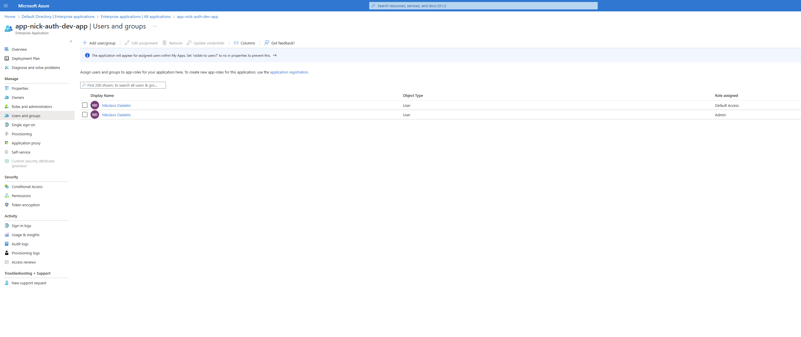

# Security

Welcome to the "Security" section of our workshop. In this part, we will delve into Proseware's Cloud Security Architecture. We'll explore how Proseware leverages advanced cloud technologies and services from Microsoft Azure and Microsoft Entra ID to secure their web applications against various cyber threats.

## Background
By default, your user account is added to the application. To enable additional users, follow these steps:

- Sign in to the [Azure Portal](https://portal.azure.com).
- Select **Azure Active Directory** -> **Enterprise Applications**.
- Search for, then select **Proseware**.
- Add the user to the application.



## Enable anonymous access to public content

In this section, we will enable anonymous access to public content.  This will allow users to view public content without having to sign in.

1. Modifying Security Configurations: Adjusting the `GlobalSecurityConfig.java` to control access, allowing public content visibility while securing other parts of the application.
2. Deploying with Azure Developer CLI: Utilizing Azure's tools to deploy and make the application live.

## Steps

### Step 1: Modify Security Configurations
**File:** `GlobalSecurityConfig.java`
1. Open `GlobalSecurityConfig.java` in your IDE.
2. Locate the `WebSecurityConfiguration` class on line 164.
3. inspect the `configure(HttpSecurity http)` method that configures HTTP security

This Java method configures HTTP security. It sets up rules for which paths require user authentication and which ones don't. It also configures Cross-Origin Resource Sharing (CORS), Cross-Site Request Forgery (CSRF) protection, and iframe options. It adds a custom filter, sets up OAuth 2.0 login, and defines logout behavior.

### Step 2: Modify Security Configurations
1. on line 180, enhance the `GlobalSecurityConfig` method to the `WebSecurityConfiguration` class by allow all requests to paths that start with "/public/" without requiring authentication:

```java
    .antMatchers("/public/**").permitAll() 
```

This method configures Spring Security to allow all requests to paths that start with `/public/` without requiring authentication.

2. Create the `public` folder in the `src/main/resources` folder. This folder will contain the public content.
3. Create a `.txt` file and save it as `public.txt` in the `src/main/resources/public` folder. This file will be used to test the public access.
4. Add the following code to the `public.txt` file:

```txt
This is public content.
```
5. Save the file.
6. Open `Reference App\src\airsonic-advanced\airsonic-main\src\main\resources\application.properties` in your IDE.
7. Add the following code to the `application.properties` file:

```properties
spring.resources.static-locations=classpath:/public/
```
8. Save the file.
9. access the application URL provided by Azure e.g. `https://proseware-<yourname>.azurewebsites.net/`
10. access the public content by adding `/public.txt` to the URL e.g. `https://proseware-<yourname>.azurewebsites.net/public.txt`
11. You should see the content of the `public.txt` file displayed in the browser.

### Step 3: Deploy the App with Azure Developer CLI
1. Deploy the application: `azd up`
2. Once deployed, access the application URL provided by Azure.

## Conclusion
You have now enhanced your application's security and successfully deployed it using Azure Developer CLI.

Next, we will delve into operational excellence in cloud applications. Please proceed to [Part 6 - Operational Excellence](../Part6-Operational-Excellence/README.md) for more information.

## Resources
[Well-Architected Framework security portal](https://learn.microsoft.com/en-us/azure/well-architected/security)
[Security Checklist](https://learn.microsoft.com/azure/well-architected/security/checklist)