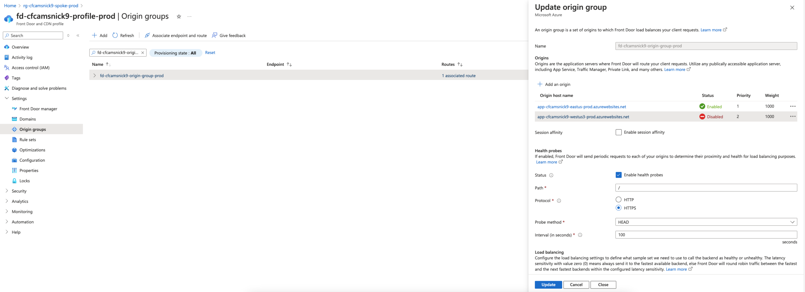
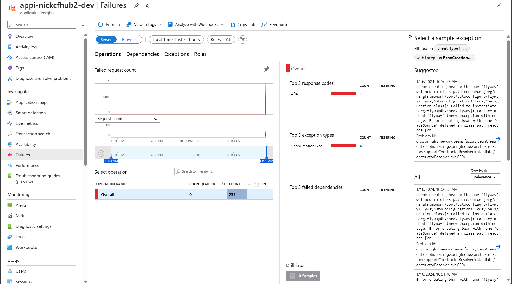
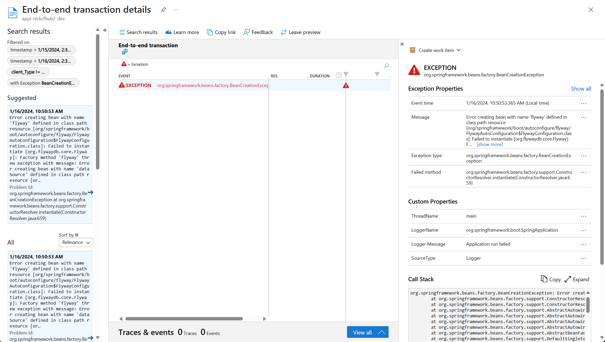
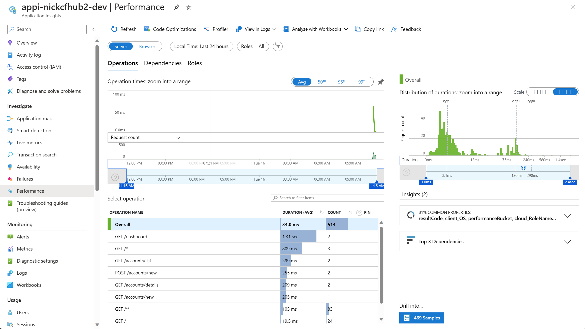
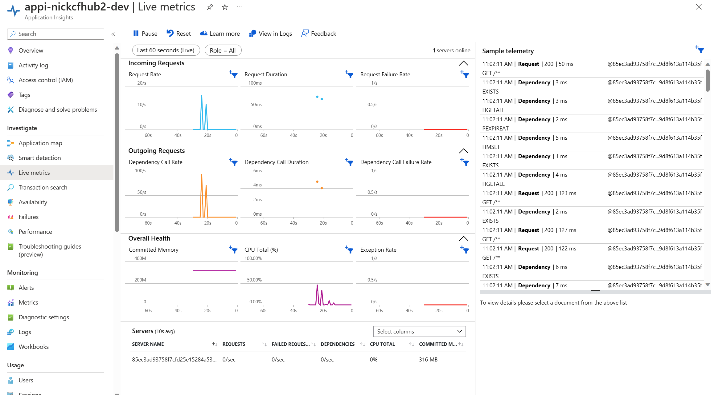

# Operational Excellence

Proseware aims for a 99.9% service level objective to ensure reliability and availability. Operational excellence in cloud applications involves monitoring, diagnostics, and recovery strategies. In the production environment, we adopt a multi-region deployment approach with manual rerouting to a secondary region during unexpected downtimes. This ensures continuous operation and a minimum 99.9% service-level objective. This section demonstrates how these foundational practices can be expanded into comprehensive monitoring and operational strategies to handle larger-scale operations and more complex scenarios.

An **Azure Database for PostgreSQL Flexible Server** is in the secondary region. This database is a read replica of the primary database. In the event of an outage in the primary region, the application can continue to function using the secondary database.

## Exercise - Application Map

## Application Insights

Exceptions in the Contoso Fiber CAMS web application are reported with Application Insights.

Click on an exception to see the end-to-end details:

Navigate to the Application Map blade:

Navigate to the Performance blade:

Navigate to the Live Metrics blade to see real-time performance:

## Next Up

Next, we will explore performance efficiency in cloud applications. > [Part 7 - Performance Efficiency](../Part7-Performance-Efficiency/README.md)

## Resources
[Well-Architected Framework operational excellence portal](https://learn.microsoft.com/en-us/azure/well-architected/operational-excellence)

