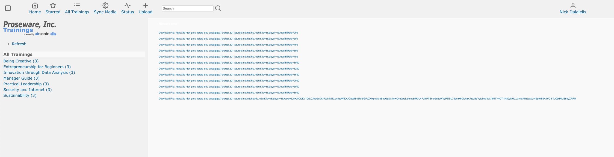
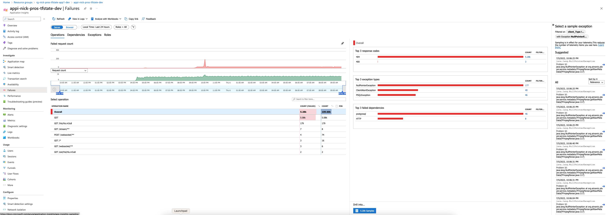
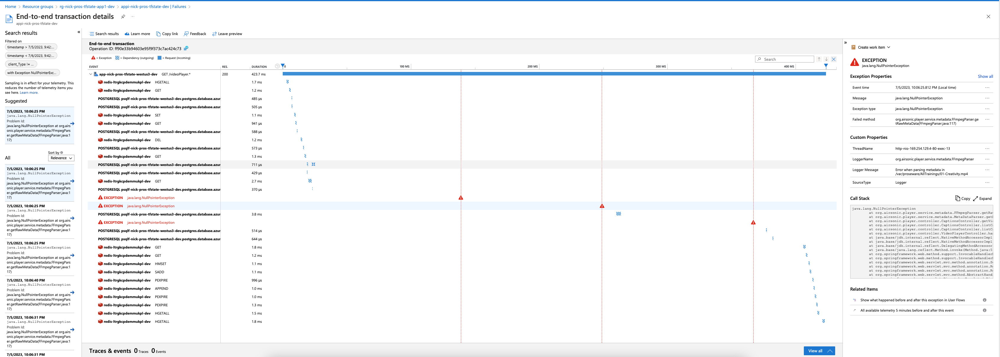

# Operational Excellence

One of Proseware's business objectives is to reach a 99.9% service level objective for availability. To meet that objective, the web app is deployed to two regions in an active-passive configuration. The active (primary) region handles 100% of user traffic under normal operations, and data is replicated to the passive (secondary) region asynchronously. 

Application Insights sends web requests to your application at regular intervals from points around the world. It can alert you if your region isn't responding or if it responds too slowly. In this section, we will look at using application insights to identify any issues that might arise in the region. 

## Monitoring

The reference implementation demonstrates how to programmatically enable Application Insights by adding the following Maven dependency to the `pom.xml` file located at `Reference App/src/airsonic-advanced/airsonic-main/`.

```xml
<dependency>
   <groupId>com.microsoft.azure</groupId>
   <artifactId>applicationinsights-runtime-attach</artifactId>
   <version>3.4.7</version>
</dependency>
```

This dependency adds the necessary Application Insights components to your application build. It allows you to visualize metrics in Azure Application Insights. Spring Boot registers several core metrics in Application Insights such as Java virtual machine (JVM), CPU, Tomcat, and others. Application Insights automatically collects from logging frameworks such as Log4j and Logback.

## Application Map

The Application Map in Application Insights provides a visual representation of the components in your application and the relationships between them. It automatically discovers application components and maps the communication between them. The Application Map is useful for identifying performance bottlenecks and failures in your application.

1. Select **Application Map** from the left-hand menu.
2. Select the **Web** component to view the Application Map for your application.

In Part 4, we triggered a failure, and the exceptions from Part 4 in the Proseware web application were reported with Application Insights. As you recall, some videos in Proseware cannot be played correctly. 



Open *Application Insights*, and find the `NullPointerException` that was thrown while processing the videos.




## Conclusion

Combined with Part 4, maintaining operational excellence in your cloud application involves a combination of monitoring, diagnostics, and recovery strategies. By leveraging Azure services, you can ensure your application remains robust and resilient under varying operational conditions and quickly transition from your primary region to the secondary one to mitigate the risk of an outage from impacting availability.

Next, we will explore performance efficiency in cloud applications. Please proceed to [Part 7 - Performance Efficiency](../Part7-Performance-Efficiency/README.md) for more information.

## Resources
[Well-Architeched Framework operational portal](https://learn.microsoft.com/en-us/azure/well-architected/operational-excellence)
