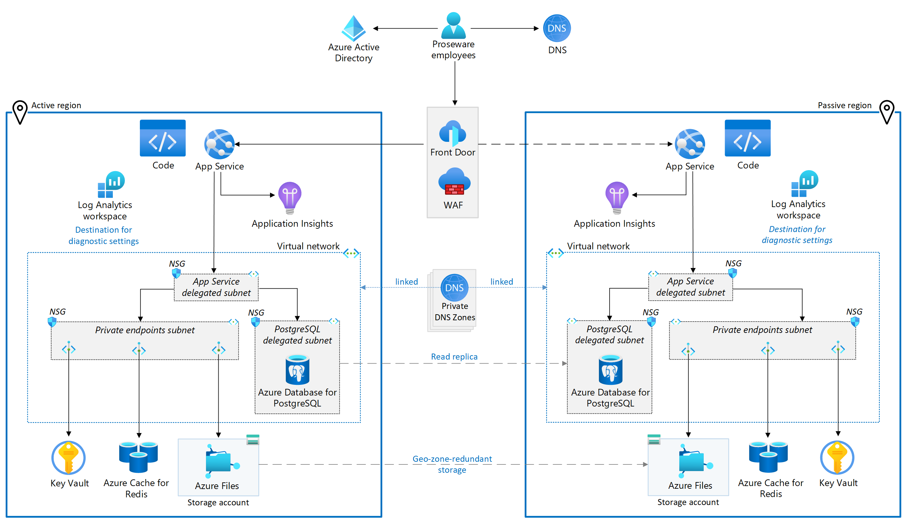

# Proseware failover playbook

One of Proseware's business objectives was to reach a 99.9% service level objective for availability. To meet that objective, the web app is deployed to two regions in an active-passive configuration. The active (primary) region handles 100% of user traffic under normal operations and data replicates to the passive (secondary) region asynchronously. This configuration enables Proseware to quickly transition from the primary region to the secondary to mitigate the risk of an outage from impacting their availability.

## Understanding the architecture

In this part we will execute part of the the failover plan, which is to failover the web app from the primary region to the secondary region. The following diagram shows the architecture of the reference implementation.

Steps to failover the web app from the primary region to the secondary region:

1.  Disable the primary region
2.  Enable the secondary region
3.  Update the DNS record to point to the secondary region

## Failover the web app

1.  Open the Azure portal and navigate to the **Resource groups** blade.
2.  Select the resource group that contains the primary web app.
5.  Wait for the failover to complete.
6.  Once the failover is complete, navigate to the web app in the secondary region and verify that the web app is running in the secondary region.
7.  Navigate to the web app in the primary region and verify that the web app is stopped.
8.  Navigate to the Traffic Manager profile and verify that the profile is now pointing to the secondary region.

In conclusion, maintaining operational excellence in your cloud application involves a combination of monitoring, diagnostics, and recovery strategies. By leveraging Azure services, you can ensure your application remains robust and resilient under varying operational conditions.

Next, we will explore performance efficiency in cloud applications. Please proceed to [Part 7 - Performance Efficiency](../Part7-Performance-Efficiency/README.md) for more information.
