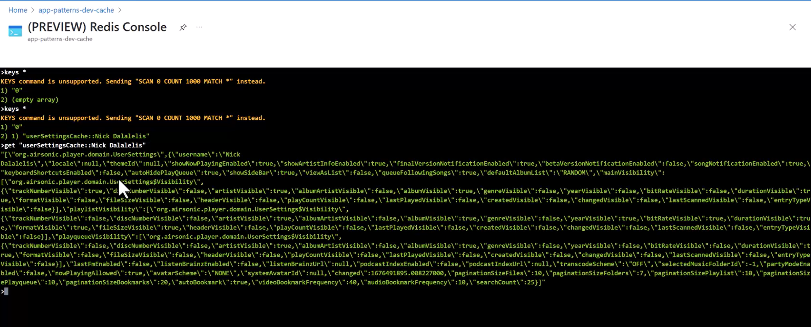

# Performance Efficiency

Performance efficiency is the ability of a workload to scale and meet the demands placed on it by users in an efficient manner. In cloud environments, a workload should anticipate increases in demand to meet business requirements.

## The Cache-Aside pattern

The Cache-Aside pattern is a technique that's used to manage in-memory data caching. It reduces the request response time and can lead to increased response throughput. This efficiency reduces the number of horizontal scaling events, making the app more capable of handling traffic bursts. It also improves service availability by reducing the load on the primary data store and decreasing the likelihood of service outages.

## Cache-Aside Pattern

The cache-aside pattern enables us to limit read queries to  the Azure PostgreSQL Flexible Server. It also provides a layer of redundancy that can keep parts of our application running in the event of issue with Azure PostgreSQL Database.

For more information, see [cache-aside pattern](https://learn.microsoft.com/azure/architecture/patterns/cache-aside).

1. Navigate to https://<APP_NAME>.azurewebsites.net/index and refresh the page. The first time you refresh the page, a call to GitHub is made. In subsequent requests we see that the API call was only 55ms because it didn't have to connect to SQL Server and instead used the data from Azure Cache for Redis.

Using the (PREVIEW) Redis Console, we can see this data stored in Redis. To access the Redis Console, select the `Console` tab in the working pane of the `Resource menu`. You can securely issue commands to your Azure Cache for Redis instances from the Azure portal over a TLS connection. The console is a great way to test out Redis commands and experiment with the data store. You can also use the console to view the current state of your Redis instance.




## Cleaning up

Thank you for attending this workshop.  We hope you learned something and feel more comfortable tackling the patterns that are used in enterprise web applications.  You can now clean up the resources that you used:

To tear down the deployment, run the following command:

```shell
azd down
```

