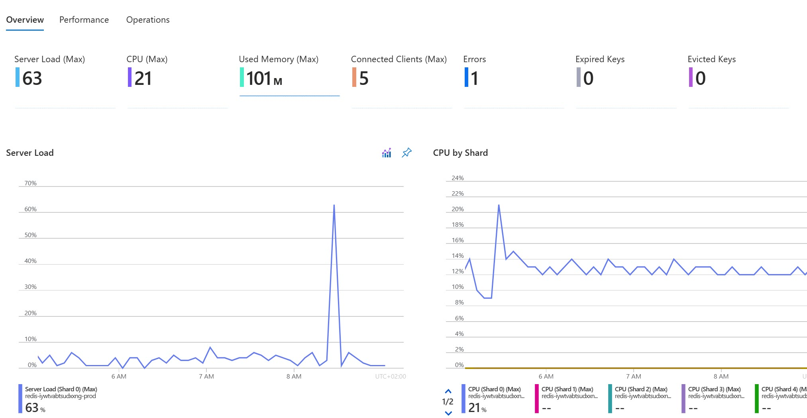
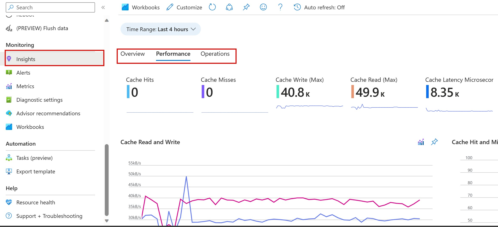
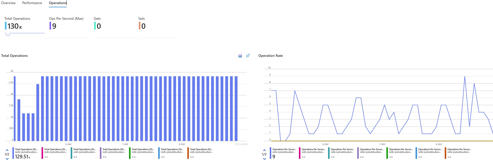

# Performance Efficiency

Performance efficiency is the ability of a workload to scale and meet the demands placed on it by users in an efficient manner. In cloud environments, a workload can anticipate increases in demand to meet business requirements using caches.

## The Cache-Aside pattern

The Cache-Aside pattern is a technique that's used to manage in-memory data caching. It reduces the request response time and can lead to increased response throughput. This efficiency reduces the number of horizontal scaling events, making the app more capable of handling traffic bursts. It also improves service availability by reducing the load on the primary data store and decreasing the likelihood of service outages.

The cache-aside pattern enables us to limit read queries to  the Azure PostgreSQL Flexible Server. It also provides a layer of redundancy that can keep parts of our application running in the event of issue with Azure PostgreSQL Database.

For more information, see [cache-aside pattern](https://learn.microsoft.com/azure/architecture/patterns/cache-aside).

## Exercise - Caching

- As per Part 4, let's create some traffic so navigate to https://<APP_NAME>.azurewebsites.net/index and refresh the page. 
- As we witnessed in Part 4, The first time you refresh the page, a call to GitHub is made. In subsequent requests, we see that the API call was only 55ms because it didn't have to connect to SQL Server and instead used the data from Azure Cache for Redis.
- As we witnessed in Part 6, we can use Application Insights to view these cache hits:
    - Navigate to your application resource group
    - Select the **Azure redis cache**.
    - Select **Application insights** from the left-hand menu.

The default **Overview** table shows these columns:

- **Used Memory**
- **Server Load**
- **CPU**
- **Connected Clients**
- **Expired and Evited Keys**
- **Errors (Max)**



The default **Performance** table shows these columns:

- **Cache Read and Write**
- **Cache Hit and Miss**



The default **Operations** table shows these columns:

- **Total Operations**
- **Gets and Sets**



## Conclusion

Use caching to store frequently accessed data or content, reducing the load on your backend infrastructure. The Cache aside pattern checks the cache to see if the data is already stored in memory. If the data is found in the cache, the application can quickly retrieve and return the data, reducing the need to query the persistent data store.

## Workshop Summary

In this workshop we focused on a different aspect of building and deploying a reliable web application pattern with Java on Microsoft Azure. Here's a summary of what we learnt from each part:

| Part | Description |
|------|-------------|
| Tooling | Introduced the tools and technologies used throughout the workshop. |
| RWA Overview | Overview of Reliable Web Applications (RWA) and the patterns used in enterprise web applications. |
| Cost Optimization| How to optimize costs using nonproduction environments. |
| Reliability | Design patterns to add redundancy throughout critical flows at different workload layers. |
| Security | Security aspects of web applications. |
| Operational Excellence | Minimize process variance, chances of human error, and disruption to customers. |
| Performance Efficiency| Caching |

## Cleaning Up

Thank you for attending this workshop.  We hope you learned something and feel more comfortable tackling the patterns that are used in enterprise web applications. You can now clean up the resources that you used.
To tear down the deployment, run the following command (the process to teardown may take up to 20 minutes):

```shell
azd down
```

## Resources
[Well-Architected Framework Performance portal](https://learn.microsoft.com/azure/well-architected/performance-efficiency)

[RWA Guidance](https://aka.ms/eap/rwa/java/doc)

[RWA Repo](https://aka.ms/eap/rwa/java)
