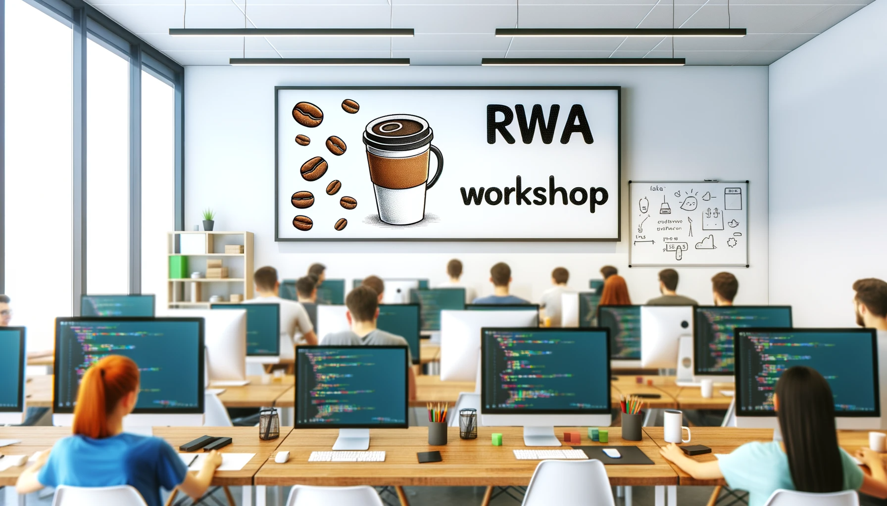

# Reliable Web Apps Java Workshop

[Go to Glossary](#glossary)

This workshop is designed to help you learn how to take your application's first step into the cloud and build reliable web applications using Java. You can think of the Reliable Web Application (RWA) pattern as a pattern of patterns. Each pattern provides prescriptive guidance on how to build a specific aspect of a reliable web application. You can use them together or separately.

Start Here 👉[Part 1 - Tooling](Part1-Tooling/README.md)

## Table of Contents

- [1️⃣ Part 1 - Tooling](Part1-Tooling/README.md)
- [2️⃣ Part 2 - RWA Overview](Part2-RWA-Overview/README.md)
- [3️⃣ Part 3 - Cost Optimization](Part3-Cost-Optimization/README.md)
- [4️⃣ Part 4 - Reliability](Part4-Reliability/README.md)
- [5️⃣ Part 5 - Security](Part5-Security/README.md)
- [6️⃣ Part 6 - Operational Excellence](Part6-Operational-Excellence/README.md)
- [7️⃣ Part 7 - Performance Efficiency](Part7-Performance-Efficiency/README.md)

## Prerequisites

- [Azure Subscription](https://azure.microsoft.com/pricing/member-offers/msdn-benefits-details/)
- [Visual Studio Code](https://code.visualstudio.com/)
- [Docker Desktop](https://www.docker.com/get-started/)
- [Permissions to register an application in Azure AD](https://learn.microsoft.com/azure/active-directory/develop/quickstart-register-app)
- Visual Studio Code [Dev Containers extension](https://marketplace.visualstudio.com/items?itemName=ms-vscode-remote.remote-containers)

## Video Walkthrough

Matt Soucoup recorded a video series that walks through the same pillars and patterns as covered in this workshop. You can find the videos [here](https://www.youtube.com/watch?v=5du8gfo9M7g&list=PLI7iePan8aH5wNEbsGS13W46wA2pZQ7Ea).

## More Links and Resources

* [Reliable Web App Pattern Code Repository](https://aka.ms/eap/rwa/java)
* [Azure Architecture Guidance](https://learn.microsoft.com/azure/architecture/web-apps/guides/reliable-web-app/java/plan-implementation)
* [Applying the pattern in-depth](https://learn.microsoft.com/azure/architecture/web-apps/guides/reliable-web-app/java/apply-pattern)

## Glossary

| Term                           | Description                                                                                           |
|--------------------------------|-------------------------------------------------------------------------------------------------------|
| 12-Factor App                   | A methodology for building software-as-a-service apps that emphasizes portability, scalability, and maintainability. |
| Application Insights           | An Azure service for application performance management and monitoring. |
| Azure AD | Azure Active Directory, Microsoft's cloud-based identity and access management service. |
| Azure App Service | A fully managed platform for building, deploying, and scaling web apps. |
| Azure Cache for Redis          | Managed in-memory data store based on Redis                                                           |
| Azure Database for PostgreSQL  | Managed service for PostgreSQL databases                                                              |
| Azure Files                    | Fully managed file shares in the cloud                                                                |
| Azure Front Door               | Content delivery network and global load balancer                                                     |
| Azure Key Vault                | Centralized storage of application secrets                                                           |
| Azure Monitor | A service that provides full-stack monitoring, advanced analytics, and automated insights across applications and Azure resources. |
| Azure Private Link             | Access to PaaS services over a private endpoint in your virtual network                               |
| Azure Web Application Firewall | Centralized protection of web apps from exploits and vulnerabilities                                 |
| Azure Well-Architected Framework | A guide for building secure, high-performing, resilient, and efficient applications on Azure. |
| Cache-Aside Pattern | A caching pattern where the application code first checks if data is in the cache before retrieving it from the data store. |
| Circuit-Breaker Pattern | A design pattern that stops the application from performing an operation that's likely to fail. |
| Composite SLA                   | Overall availability estimate based on dependencies and architecture                                |
| Dev Containers | A feature in Visual Studio Code that allows you to use a Docker container as a full-featured development environment. |
| Docker | A tool designed to make it easier to create, deploy, and run applications by using containers. |
| Microsoft Entra ID             | Cloud-based identity and access management service                                                    |
| PostgreSQL Flexible Server | A configurable option in Azure for deploying PostgreSQL databases, offering scalability and flexibility. |
| Redis Cache | An in-memory data store used as a database and cache, known for its speed and support for various data structures. |
| Reliable web app pattern       | Principles for updating web apps for the cloud                                                       |
| Retry Pattern | A design pattern that enables an application to retry an operation in the expectation that it'll succeed. |
| Service level agreement (SLA)  | Provider’s commitment to certain service levels                                                       |
| Service level objective (SLO)  | Target for web app availability                                                                       |
| SKU | Stock Keeping Unit, a specific version or configuration of a cloud service or resource. |
| Spring Boot Actuator | A tool to help monitor and manage Spring Boot applications. |
| The Five Pillars | The reliable web app pattern is built off of 5 pillars. Each pillar is a set of patterns that are derived from both the Azure Well-Architected Framework and 12-factor app methodology. |
